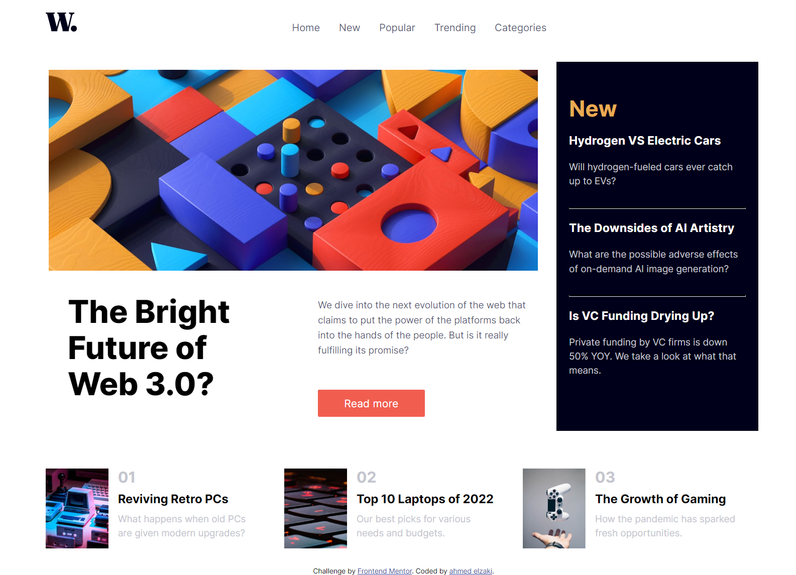

# Frontend Mentor - News homepage solution

This is a solution to the [News homepage challenge on Frontend Mentor](https://www.frontendmentor.io/challenges/news-homepage-H6SWTa1MFl). Frontend Mentor challenges help you improve your coding skills by building realistic projects.

### The challenge

Users should be able to:

- View the optimal layout for the interface depending on their device's screen size
- See hover and focus states for all interactive elements on the page
- **Bonus**: Toggle the mobile menu (requires some JavaScript)

### Screenshot

### Links

- Solution URL: (https://github.com/ahmedelzaky/news-homepage-main)
- Live Site URL:(https://ahmedelzaky.github.io/news-homepage-main/)

### Built with

- CSS custom properties
- Flexbox
- CSS Grid
- Little JS

## Author

- Frontend Mentor - [@ahmedelzaky](https://www.frontendmentor.io/profile/ahmedelzaky)
- Linkedin - [@ahmed-el-zaki]https://www.linkedin.com/in/ahmed-el-zaki/)
